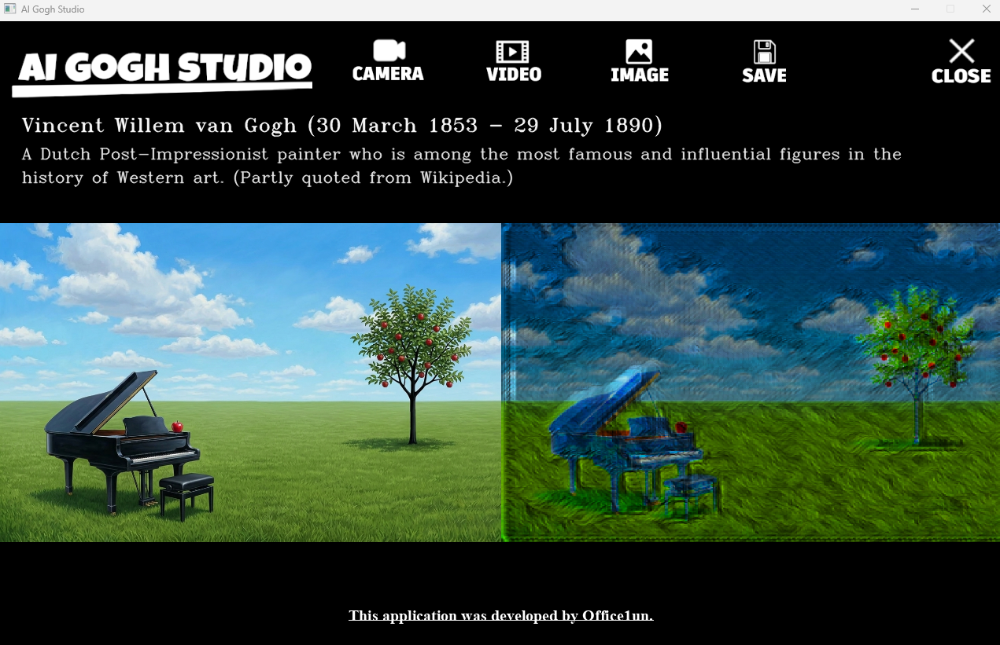

# 🎨 AI Gogh Studio


**AI Gogh Studio** is a professional-grade real-time style transfer application developed by **Office1un**. 
It transforms your world into a living masterpiece inspired by Vincent van Gogh using Deep Learning (TransformerNet).

---

## 📺 Demo & Gallery

<h3 style="color: #1a0454; font-weight: bold;">🔵 App Demo</h3>



> 💡 GitHub supports direct video uploads (mp4) and images (png/jpg).

<br>

<h3 style="color: #1a0454; font-weight: bold;">🔵 Video Conversion</h3>


---

## ✨ Key Features

* 🖼️ **Real-time Transformation**: Instant Van Gogh style applied to your webcam feed.
* 📹 **Video Processing**: Convert MP4 files with high-fidelity artistic rendering.
* 📷 **Image Processing**: Transform static photos into digital oil paintings.
* 💾 **One-Click Export**: Save your creations directly to your local drive.
* 🌑 **Pro UI**: Sleek, pure-black interface with a formal cursive signature.

---

## 🛠️ System Requirements

* **OS**: Windows 10/11 (64-bit)
* **GPU**: NVIDIA GeForce RTX 3070 or higher (Recommended)
* **CUDA**: 11.8
* **Python**: 3.10.x

---

## 🚀 Getting Started

### 1. Prerequisites
Install NVIDIA CUDA Toolkit 11.8 and Python 3.10.

### 2. Installation
Clone this repository and install the required dependencies:

```bash
git clone [https://github.com/office1un/AI-Gogh-Studio.git](https://github.com/office1un/AI-Gogh-Studio.git)
cd AI-Gogh-Studio
```

```bash
pip install -r requirements.txt
```

### 3. Model Assets
Place your trained model file in the ./models/ directory:

```bash
./models/gogh_style_model.pth
```

### 4. Run

```bash
python run.py
```

## 📂 Project Structure

```text
AI-Gogh-Studio/
├── run.py                　　　　# Main application executable
├── requirements.txt      　　　　# Dependency manifest
├── README.md             　　　　# This document
├── models/               　　　　# Model assets directory
│   └── gogh_style_model.pth
└── images/               　　　　# UI Visual assets
    ├── title.png         　　　　# Branding
    └── ...               　　　　# Icons (camera, video, image, save, close)
```

## 📜 License<BR>
This project is licensed under the MIT License. See the LICENSE file for details.

## 👨‍💻 Developer<BR>
Produced by Office1un<BR>
Developed by Shigenobu Anbo<BR>
Location: Kazuno City, Akita, Japan
